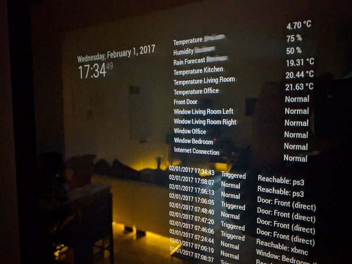

# Magic Mirror Module alertR Sensors
This module for the [MagicMirror](https://github.com/MichMich/MagicMirror) shows the state of the sensors of the [alertR monitoring and alarm system](https://github.com/sqall01/alertR).



(The module on the top right of the mirror)

# Installation

1. This module needs the alertR Manager Client Database to communicate with the alertR system. Please follow [this tutorial](https://github.com/sqall01/alertR/wiki/Tutorial-ManagerClientDatabase) to install and configure it.

2. This module needs the npm mysql module installed:

```bash
npm install mysql
```

3. Execute the following commands to install the module:

```bash
cd ~/MagicMirror/modules # navigate to module directory of your magic mirror
git clone https://github.com/sqall01/MMM-alertRsensors.git # clone this module
```

4. Add the following into the `modules` section of your `config/config.js` file:

```bash
{
        module: 'MMM-alertRsensors',
        position: 'top_right', // This can be any of the regions
        config: {
            // See 'Configuration options' for more information
        }
},
```

## Configuration options

The following properties can be configured:

| Option                        | Description
| ----------------------------  | -----------
| `host`                        | The host the MySQL server is running on. <br><br> **Example:** `'localhost'`
| `user`                        | The user to connect to the MySQL server. <br><br> **Example:** `'root'`
| `password`                    | The password to connect to the MySQL server.
| `database`                    | The database used by the MySQL server. <br><br> **Example:** `'mm_alertr'`
| `sensors`                     | A list of sensors that should be displayed by the mirror.
| `username`                    | Username of the alertR client that provides this sensor. This username is used by the alertR client to connect to the alertR server. <br><br> **Example:** `'weather_sensor_user'`
| `remote_sensor_id`            | The id that is given by the alertR client to this sensor. This id is used to identify the exact sensor that should be displayed. Note, this is the id given by the client and not the unique id given by the server. <br><br> **Example:** `0`
| `show_data`                   | If the sensor holds data like a temperature, this sets if the data is shown or just the state of the sensor. <br><br> **Example:** `true`
| `unit`                        | If the sensor holds data, this gives the unit of the sensor that should be displayed. <br><br> **Example:** `"°C"`
| `relabel`                     | This module displays the description of the alertR sensor. But if this description is too cryptic to be shown on a mirror in your living space, you can relabel it with this option. If you do not want to relabel it, just set an empty string. <br><br> **Example:** `"Temperature"` <br> **Example:** `""`

An example configuration could look like this:

```bash
{
        module: 'MMM-alertRsensors',
        position: 'top_right', // This can be any of the regions
        config: {
                host: 'localhost',
                user: 'root',
                password: 'mysqlpassword',
                database: 'mm_alertr',

                sensors: [
                        // Temperature
                        {username: "weather_sensor_user",
                        remote_sensor_id: 0,
                        show_data: true,
                        unit: "°C",
                        relabel: "Temperature"},

                        // Front Door
                        {username: "livingroom_sensor_user",
                        remote_sensor_id: 0,
                        show_data: false,
                        unit: "",
                        relabel: "Front Door"},
                ]
        }
},
```


# Support

If you like this project you can help to support it by contributing to it. You can contribute by writing tutorials, creating and documenting exciting new ideas to use it, writing code for it, and so on.

If you do not know how to do any of it or do not have the time, you can support me on [Patreon](https://www.patreon.com/sqall).

[](https://www.patreon.com/sqall)